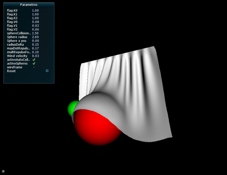

# Cloth simulation

> Florian Torres



## Install

```shell
git clone https://github.com/torresf/cloth-simulation
cd cloth-simulation
mkdir build
cd build
cmake ..
make -j
./flag
```

## Commands

- Hold left click and move your mouse to turn around the scene
- Press space to toggle wireframe mode
- Use the arrow keys to move the red sphere obstacle
- `+` / `-` to increase the wind intensity

## Features

- Cloth Simulation : Hook / Leapfrog
- Sphere Obstacles
- Auto-collisions
